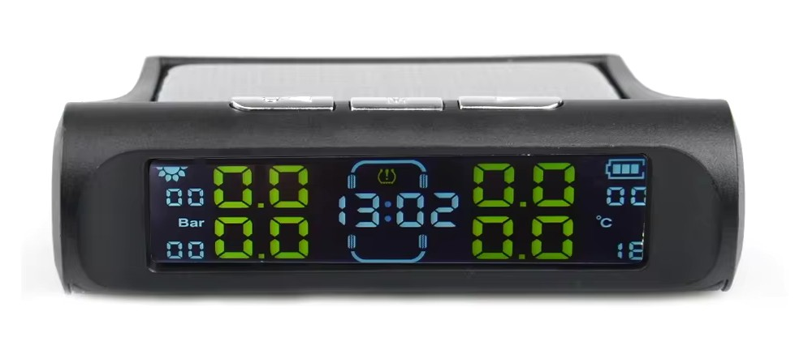
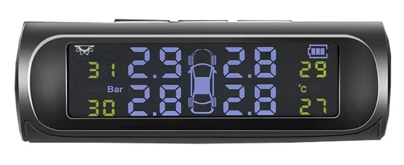
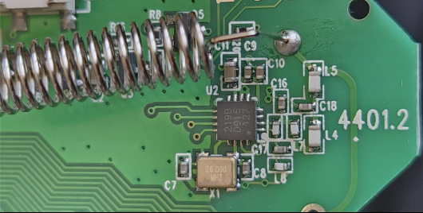
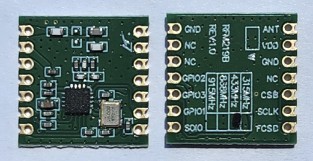

# Solar TPMS Receiver

This Arduino project receives values from aftermarket TPMS sensors that used CMT2219B like these:

 
 

This is the picture of the RF receiver IC, CMT2219B. CMT2219B has "219B" marker on the first line. Following lines shows manufacturing year, week and batch number. So 2nd and 3rd lines might be different.  

HopeRF sells ready-to-use module, RFM219BW. You just need RFM219BW, Arduino Pro Mini **(3.3V)** and antenna to run this project. 
 

## RFM219BW Pins

- 433MHz antenna must be soldered to the ANT pin.
- VDD must be connected to 3.3V power supply.
- GND must be connected to GND pin of the Arduino.
- CSB is the Chip Select pin for settings registers. It can be connected to any pin of the Arduino. **(Default: 6)**
- FCSB is the Chip Select pin of the FIFO (data) registers. It can be connected to any pin. **(Default: 4)**
- SCLK is the clock pin, it can be connected to any pin. **(Default: 5)**
- SDIO is data in and out pin, it can be connected to any pin. **(Default: 3)**
- GPIO2 is configured as an interrupt pin. So it must be connected to one of the interrupt pins: 2 or 3. **(Default: 2)** 
- GPIO1 and GPIO3 is not used.

_Note: CMT2219B uses SPI for communication. But single pin (SDIO) is used for both MOSI and MISO. Standard SPI pins (11-13) and SPI library is not used because of this._

## Story and credits

I used a logic analyzer to inspect communication between the microcontroller and CMT2219B. I obtained register values for the address space 0x00 - 0x5F by this way.

I saw some weird things like writing into read-only registers. Therefore I rewrote the initializing part with the help of documents, AN161-CMT2219BQuickStartGuide-EN-V1.0-171121.pdf and AN167-CMT2219B_FIFO_and_Packet_Format_Operation_Guide-EN-v1.0-171121.pdf .

I used this project to parse raw data: https://www.hackster.io/jsmsolns/arduino-tpms-tyre-pressure-display-b6e544 which I think influenced by the rtl_433 project (https://github.com/merbanan/rtl_433/blob/master/src/devices/tpms_truck.c).

I used a random forum post for the 3-wire SPI (single pin for MISO and MOSI), but I can't find it again.

This project couldn't have been finished without them.
